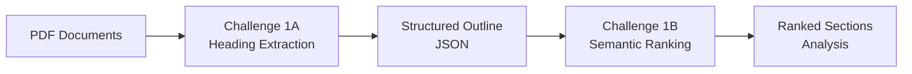

# Adobe-Hack - PDF Intelligence Suite

A comprehensive PDF analysis toolkit that combines intelligent heading extraction with semantic section ranking, built for the Adobe Hackathon. This project consists of two integrated challenges that work together to provide advanced PDF document analysis capabilities.

---

## Project Overview

This repository contains two complementary PDF processing tools:

- **Challenge 1A**: PDF Heading Extraction using Machine Learning
- **Challenge 1B**: Semantic Section Ranking and Analysis

Together, they form a complete pipeline for extracting, understanding, and analyzing PDF documents based on user-defined criteria.

---

## Components

### 🔍 Challenge 1A - PDF Heading Extraction

Located in `/challenge_1a/`

- Extracts text spans from PDFs using pdfminer.six
- Classifies headings using trained ML models (DecisionTreeClassifier)
- Outputs structured JSON outlines with heading levels (H1, H2, etc.)
- Features: Font analysis, bold/italic detection, numbering patterns

### 🎯 Challenge 1B - Semantic Section Ranking

Located in `/challenge_1b/`

- Processes extracted sections from Challenge 1A
- Ranks sections by semantic relevance using SentenceTransformer models
- Supports persona-based and job-specific queries
- Outputs top-K ranked sections with importance scores

---

## Quick Start

### Prerequisites

- Python 3.10+
- Docker (optional)

### Setup

1. **Clone the repository**

   ```bash
   git clone https://github.com/pranayyb/adobe-hack.git
   cd adobe-hack
   ```

2. **Choose your challenge**

   - For PDF heading extraction: `cd challenge_1a/`
   - For semantic section ranking: `cd challenge_1b/`

3. **Follow individual setup instructions**
   Each challenge has its own detailed README with specific setup and usage instructions.

---

## Workflow



1. **Extract**: Challenge 1A processes PDFs and extracts structured headings
2. **Analyze**: Challenge 1B takes the structured data and ranks sections by relevance
3. **Deliver**: Get targeted, ranked content based on your specific needs

---

## Use Cases

- **Document Research**: Quickly find relevant sections across multiple PDFs
- **Content Analysis**: Analyze document structure and extract key topics
- **Knowledge Mining**: Semantic search through technical documentation
- **Report Generation**: Extract and rank content for specific personas/jobs

---

## Tech Stack

- **Python 3.10** - Core language
- **Machine Learning**: scikit-learn, SentenceTransformers
- **PDF Processing**: pdfminer.six
- **Data Processing**: pandas, numpy
- **Containerization**: Docker

---

## Project Structure

```
adobe-hack/
├── challenge_1a/          # PDF heading extraction
│   ├── input/             # Input PDF files
│   ├── output/            # Extracted outlines (JSON)
│   ├── models/            # Pre-trained ML models
│   └── main.py            # Heading extraction script
├── challenge_1b/          # Semantic section ranking
│   ├── pdfs/              # Input PDF files
│   ├── output/            # Ranked analysis (JSON)
│   ├── minilm/            # SentenceTransformer model
│   └── main.py            # Section ranking script
├── .gitignore             # gitignore file  
└── README.md              # This file
```

---

## Getting Started

1. **Start with Challenge 1A** to extract PDF structure
2. **Move to Challenge 1B** for semantic analysis
3. **Check individual READMEs** for detailed instructions
4. **Run via Docker** for easiest setup

---

## License

This project is licensed under the MIT License - see the [LICENSE](LICENSE) file for details.

---

## Author

**Pranay Buradkar**

- GitHub: [@pranayyb](https://github.com/pranayyb)

---

## Acknowledgments

- Adobe Hackathon for the challenge and inspiration
- Open source communities for the excellent tools and libraries
